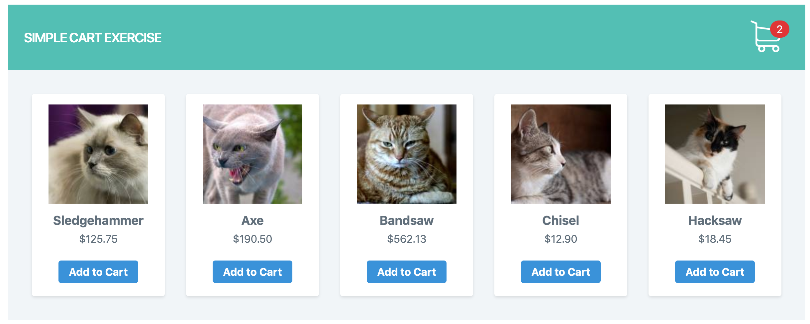
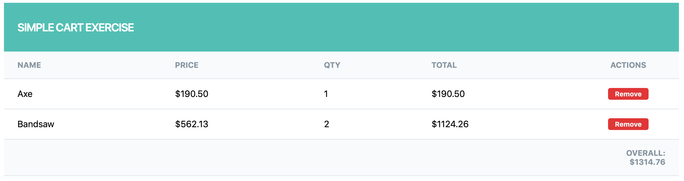

# Simple Shopping Cart




## Objective
Write a simple PHP Class for a basic shopping cart.

## Supplied
Products in an array (these do not require any editing).

## Requirements
* The cart will need to keep its "state" during page loads / refreshes.
* List Products – these should be listed at all times to allow adding of products.
* Products should be listed in this format: product name, price, link to add product.
* Must be able to add a product to the cart.
* Must be able to view current products in the cart.
* Cart products should be listed in this format: product name, price, quantity, total, remove
link.
* Product totals should be tallied to give an overall total.
* Must be able to remove a product from the cart.
* Adding an existing product will only update existing cart product quantity (e.g. adding the
same product twice will NOT create two cart items).
* All prices should be displayed to 2 decimal places.
* Error checking will be set to strict for viewing completed code.
* Project will work as expected in PHP 7.0+.

This task should take 1-2 hours max. HTML look will not be a consideration when viewing the
finished code.

## Product List
```
<?php
// ######## please do not alter the following code ########
$products = [
    [ "name" => "Sledgehammer", "price" => 125.75 ],
    [ "name" => "Axe", "price" => 190.50 ],
    [ "name" => "Bandsaw", "price" => 562.131 ],
    [ "name" => "Chisel", "price" => 12.9 ],
    [ "name" => "Hacksaw", "price" => 18.45 ],
];
// ########################################################
```

## Requirements
* PHP 7.2 or greater
* Composer (https://getcomposer.org/)

## Steps to run
1. `git clone [this repository]`
2. `cd [this repository]`
3. `composer install`
4. `php -S localhost:[port] -t public/`
5. `Open http://localhost:[port] in the browser`
